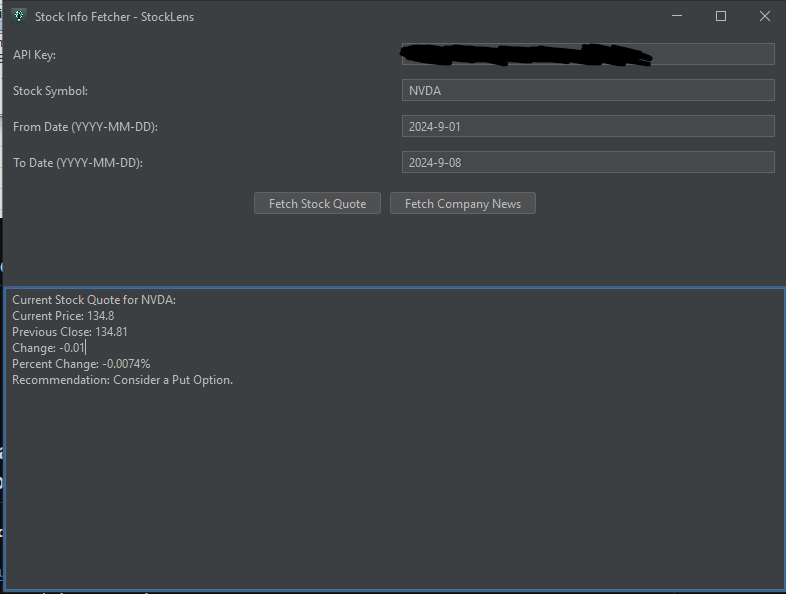

# StockLens

## Overview

Java-based desktop application that fetches market data and news.

## Features

- Fetch real-time stock quotes using the Finnhub API.
- Advice on placing puts/calls.
- Retrieve recent company news articles related to the specified stock.
- User-friendly interface with clickable links for additional resources.




## Setup and Installation

Create free API key: [Finnhub Dashboard](https://finnhub.io/dashboard )

Clone the Repository: 
   ```bash
   git clone https://github.com/jacobkobr/StockLens.git
   cd StockLens
